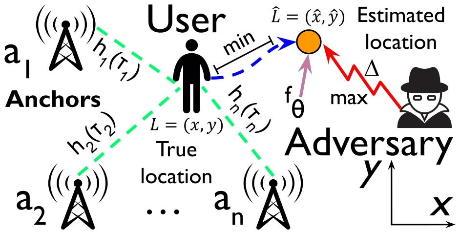
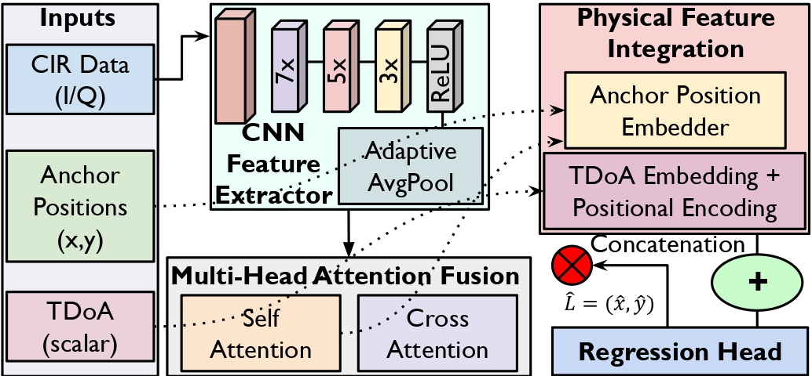
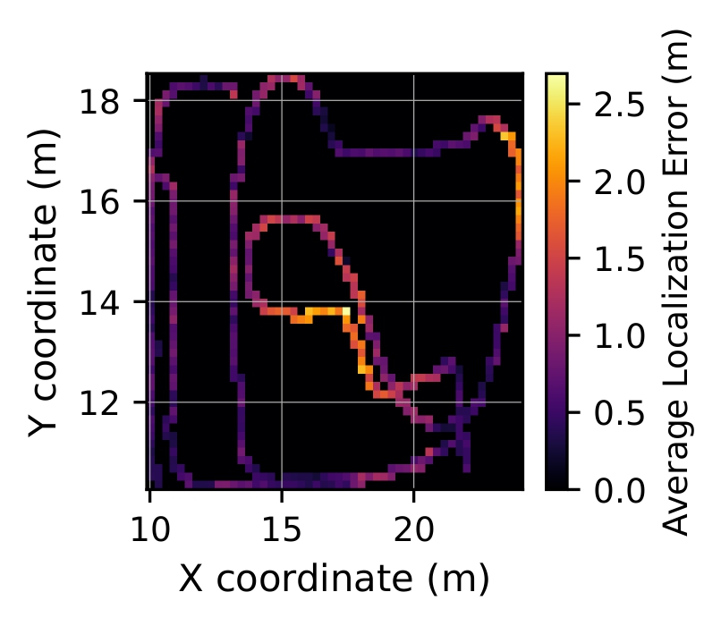
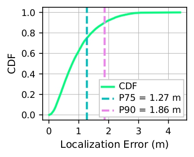

# Sec5GLoc: Securing 5G Indoor Localization via Adversary-Resilient Deep Learning Architecture

Our work addresses security and privacy challenges in 5G indoor localization by proposing an adversary-resilient deep learning architecture. Sec5GLoc combines Channel Impulse Response (CIR) fingerprinting with Time Difference of Arrival (TDoA) features and known anchor positions, processed by a hybrid CNN and multi-head attention network. This design enhances robustness against threats like location spoofing and adversarial signal manipulation.

<div align="center">
    <table>
        <tr>
            <td>
                
                <div align="center"><strong>Figure 1.</strong> Problem formulation of secure and robust 5G localization under adversarial signal perturbations and physical-layer threats.</div>
            </td>
            <td>
                
                <div align="center"><strong>Figure 2.</strong> Sec5GLoc model: CIR features are extracted using shared CNN; anchor positions and TDoA features are embedded and fused via attention, then passed to a regression head to predict the location.</div>
            </td>
        </tr>
    </table>
</div>

---
## Features

*   **Deep Learning Model (Sec5GLoc):** A hybrid CNN and multi-head attention network for robust 5G indoor localization.
*   **Dataset Handling:** Scripts for loading, preprocessing, and splitting the 5G CIR dataset.
*   **Training & Evaluation:**
    *   Training script for the Sec5GLoc model and its ablations.
    *   Testing script for evaluating performance under benign conditions.
    *   Testing script for evaluating robustness against various attacks (spoofing, noise, dropped anchors).
*   **Baseline Implementations:**
    *   k-Nearest Neighbors (k-NN) fingerprinting baseline.
    *   Geometric Time Difference of Arrival (TDoA) multilateration baseline.
*   **Plotting Utilities:** Scripts to generate figures for visualizing results (CDF, scatter plots, heatmaps, etc.).

## Dataset

This project utilizes a public 5G indoor localization dataset featuring Channel Impulse Responses (CIRs). The dataset was collected in a large industrial warehouse environment (approx. 1,200m²) using 8 fixed 5G anchors and an uplink transmission from a user device. Key characteristics:
*   **Signal Type:** 5G New Radio (NR)
*   **Bandwidth:** 100 MHz
*   **Center Frequency:** 3.75 GHz
*   **Data:** Channel Impulse Responses (CIRs), Time of Arrival (TOA), and ground truth positions.
*   **Environment:** Mixed Line-of-Sight (LOS) and Non-Line-of-Sight (NLOS) conditions.

**The original dataset collected from other authors can be found here:**
**[[5G Channel Impulse Responses Dataset]](https://owncloud.fraunhofer.de/index.php/s/GJ5fJDKl5xAjgID)** 

Our `split_dataset.py` script is used to create specific training and testing splits from the original "training.csv" (which primarily contains NLOS data):
*   `training_NLOS.csv`: 90% of the original `training.csv`, used for training the Sec5GLoc model and its ablations.
*   `test_NLOS.csv`: 10% of the original `training.csv`, used for testing on seen (NLOS) distribution.
*   `test_LOS-NLOS.csv`: This is a separate file from the original dataset providers, containing trajectories with mixed LOS and NLOS conditions, representing an unseen environment/distribution for models trained only on `training_NLOS.csv`.

## Repository Structure

```plaintext
Sec5GLoc/
├── dataset/ # Dataset files (anchors.txt, original CSVs)
│ ├── anchors.txt
│ ├── training.csv # Original full NLOS training data from dataset provider
│ └── test_LOS-NLOS.csv # Original mixed LOS/NLOS test data from dataset provider
├── dataset_splits/ # Generated by split_dataset.py
│ ├── training_NLOS.csv
│ └── test_NLOS.csv
├── knn_model_files/ # Output from baseline_knn.py (train mode)
│ ├── knn_model.joblib
│ ├── knn_model.best_params.json
│ ├── knn_model.outer_cv_metrics.json
│ └── logs/
├── knn_test_results/ # Output from baseline_knn.py (test mode)
│ ├── knn_test_predictions.csv
│ ├── knn_test_metrics.json
│ └── logs/
├── tdoa_baseline_results/ # Output from baseline_tdoa_multilateration.py
│ ├── predictions_loss_linear_weights_False.csv
│ ├── predictions_loss_linear_weights_False_metrics.json
│ └── logs/
├── sec5gloc_checkpoints/ # Output from train.py (Sec5GLoc models)
│ ├── checkpoints/
│ │ ├── model_best.pth.tar
│ │ ├── checkpoint.pth.tar
│ │ ├── training_history.json
│ │ └── logs/
│ └── ... (other runs for ablations, etc.)
├── sec5gloc_predictions/ # Output from test.py (Sec5GLoc benign evaluation)
│ ├── test_results/
│ │ ├── predictions_score1_normal.csv (for test_NLOS.csv)
│ │ ├── metrics_score1_normal.json
│ │ ├── predictions_score2_normal.csv (for test_LOS-NLOS.csv)
│ │ ├── metrics_score2_normal.json
│ │ └── logs/
├── sec5gloc_attack_results/ # Output from test_attack_noise_drop_anchor.py
│ ├── test_results/
│ │ ├── predictions_score2_spoofing_attention_main.csv
│ │ ├── metrics_score2_spoofing_attention_main.json
│ │ ├── predictions_score2_noise_attention_main_sigma0.5.csv
│ │ ├── ... (other attack results) ...
│ │ └── logs/
├── figures/ # Output from plot.py
│ ├── figure1_cdf.pdf
│ └── ...
├── dataset.py # Dataset loading and preprocessing utilities
├── model.py # Sec5GLoc model architecture
├── train.py # Script for training Sec5GLoc
├── test.py # Script for testing Sec5GLoc (benign conditions, ablations)
├── test_attack_noise_drop_anchor.py # Script for testing Sec5GLoc under attacks
├── split_dataset.py # Script to split original data into train/test CSVs
├── baseline_knn.py # k-NN fingerprinting baseline script
├── baseline_tdoa_multilateration.py # Geometric TDoA multilateration baseline script
├── plot.py # Script for generating plots from prediction files
├── Sec5GLoc_env.yml # Python package dependencies
└── README.md # This file
```
---

## Setup

**1. Clone the Repository:**
```bash
git clone https://github.com/sec5gloc/Sec5GLoc.git 
cd Sec5GLoc
```

**2. Create a Python Environment:**
We recommend using a virtual environment (e.g., Conda or venv). To set up the environment, you can use the Sec5GLoc_env.yml file:

```bash
# Using Conda
conda env create -f Sec5GLoc_env.yml
conda activate <your-environment-name>
```

**4. Download Dataset:**
*   Download the original dataset files (e.g., `training.csv`, `test_LOS-NLOS.csv`, `anchors.txt`).
*   Place them into the `dataset/` directory.
---

## Usage

**1. Prepare Dataset Splits (One-time setup):**
The original `training.csv` (NLOS only) needs to be split into a training file and a held-out test file for NLOS evaluation.
```bash
python split_dataset.py --input-csv-file dataset/training.csv --output-dir dataset_splits --train-output-name training_NLOS.csv --test-output-name test_NLOS.csv --test-split-ratio 0.1 --seed 42
```
This will create `dataset_splits/training_NLOS.csv` (90% of original `training.csv`) and `dataset_splits/test_NLOS.csv` (10% of original `training.csv`).

**2. Train the Sec5GLoc Model:**
Use `train.py` to train the main Sec5GLoc model or its ablations. The script uses `dataset_splits/training_NLOS.csv` and further splits it into training and validation sets.
```bash
python train.py \
    --data-dir ./ \
    --full-dataset-csv dataset_splits/training_NLOS.csv \
    --val-split-ratio 0.1 \
    --checkpoint-dir ./sec5gloc_checkpoints/Sec5GLoc_full_model_run1 \
    --epochs 100 \
    --batch-size 128 \
    --lr 1e-4 \
    --patience-early-stop 20 \
    --seed 42 \
    # --no-attention  # For non-attention ablation
    # --no-tdoa       # For non-TDoA ablation
    # --no-anchor-pos # For non-anchor-pos ablation (implies --no-tdoa for some features)
    # --gpu 0         # Specify GPU ID, or -1 for CPU
```
Checkpoints and logs will be saved in the specified `--checkpoint-dir`.


**3. Evaluate Sec5GLoc (Benign Conditions):**
Use `test.py` to evaluate a trained Sec5GLoc model on different test sets.
*   `score1`: Evaluates on `dataset_splits/test_NLOS.csv` (seen distribution).
*   `score2`: Evaluates on `dataset/test_LOS-NLOS.csv` (unseen distribution, mixed LOS/NLOS).

```bash
python test.py \
    --checkpoint ./sec5gloc_checkpoints/Sec5GLoc_full_model_run1/model_best.pth.tar \
    --test-set score2 \
    --data-dir ./ \
    --output-dir ./sec5gloc_predictions/results_Sec5GLoc_full_model_run1_on_LOSNLOS \
    --batch-size 256
    # --gpu 0
```
Prediction CSVs and metrics JSON files will be saved in the `--output-dir`.

**4. Evaluate Sec5GLoc (Under Attacks):**
Use `test_attack_noise_drop_anchor.py` to evaluate robustness.
```bash
# Example: Spoofing attack
python test_attack_noise_drop_anchor.py \
    --checkpoint ./sec5gloc_checkpoints/Sec5GLoc_full_model_run1/model_best.pth.tar \
    --test-set score2 \
    --data-dir ./ \
    --output-dir ./sec5gloc_attack_results/results_Sec5GLoc_full_model_run1_spoofing \
    --spoofing-attack
    # --guiding-attention-checkpoint <path_if_main_model_is_no_attention>

# Example: Noise attack
python test_attack_noise_drop_anchor.py \
    --checkpoint ./sec5gloc_checkpoints/Sec5GLoc_full_model_run1/model_best.pth.tar \
    --test-set score2 \
    --data-dir ./ \
    --output-dir ./sec5gloc_attack_results/results_Sec5GLoc_full_model_run1_noise_s0.3 \
    --noise-attack \
    --noise-sigma 0.2

# Example: Drop influential anchor
python test_attack_noise_drop_anchor.py \
    --checkpoint ./sec5gloc_checkpoints/Sec5GLoc_full_model_run1/model_best.pth.tar \
    --test-set score2 \
    --data-dir ./ \
    --output-dir ./sec5gloc_attack_results/results_Sec5GLoc_full_model_run1_drop_influential \
    --drop-influential-anchor-attack
```
**5. Run Baseline Models:**

*   **k-NN Fingerprinting:**
    *   Train:
        ```bash
        python baseline_knn.py --mode train \
            --data-dir ./ \
            --train-file dataset_splits/training_NLOS.csv \
            --model-output-dir ./knn_model_files \
            --seed 42
        ```
    *   Test (e.g., on `test_NLOS.csv`):
        ```bash
        python baseline_knn.py --mode test \
            --data-dir ./ \
            --test-file dataset_splits/test_NLOS.csv \
            --model-output-dir ./knn_model_files \
            --test-results-dir ./knn_test_results/NLOS
        ```
    *   Test (e.g., on `test_LOS-NLOS.csv`):
        ```bash
        python baseline_knn.py --mode test \
            --data-dir ./ \
            --test-file dataset/test_LOS-NLOS.csv \
            --model-output-dir ./knn_model_files \
            --test-results-dir ./knn_test_results/LOS-NLOS
        ```

*   **Geometric TDoA Multilateration:**
    *   On `test_NLOS.csv`:
        ```bash
        python baseline_tdoa_multilateration.py \
            --data-dir ./ \
            --file dataset_splits/test_NLOS.csv \
            --output-dir ./tdoa_baseline_results/NLOS \
        ```
    *   On `test_LOS-NLOS.csv`:
        ```bash
        python baseline_tdoa_multilateration.py \
            --data-dir ./ \
            --file dataset/test_LOS-NLOS.csv \
            --output-dir ./tdoa_baseline_results/LOS-NLOS \
        ```

**6. Generate Plots:**
Modify `plot.py` to point to the desired prediction CSV file (e.g., from Sec5GLoc or baselines) and the corresponding ground truth CSV.
```bash
python plot.py
```
Figures will be saved in the `figures/` directory.

## Model Architecture (Sec5GLoc)

The Sec5GLoc model (`model.py`) comprises:
1.  **CNN Feature Extractor:** A shared 1D CNN processes the real and imaginary components of each anchor's CIR to extract relevant features.
2.  **Feature Augmentation:**
    *   **Anchor Positions:** Known 2D anchor coordinates are embedded and fused.
    *   **TDoA Features:** Relative Time Differences of Arrival (TDoA) are calculated, embedded, and incorporated.
    *   *(Optional: Cross-attention between CIR features and anchor position embeddings can be used).*
3.  **Aggregation:**
    *   **Multi-Head Attention:** (Default) Dynamically weighs the features from different anchors based on their relevance and consistency.
    *   **Mean Aggregation:** (Ablation) Simple averaging of active anchor features.
4.  **Regression Head:** A Multi-Layer Perceptron (MLP) predicts the 2D user coordinates.

Key security-enhancing aspects include the inherent geometric consistency checks enabled by TDoA and anchor positions, and the attention mechanism's ability to down-weight anomalous or corrupted anchor signals.

## Results Highlights


**Benign Conditions (Mixed LOS/NLOS - `test_LOS-NLOS.csv`):**
*   **Sec5GLoc:** Mean Error ~0.58m, P75 ~0.75m, P90 ~1.19m.
*   **k-NN Fingerprinting:** Mean Error ~3.31m.
*   **Classical TDoA:** Mean Error ~2.25m.

**Table 1. Performance of Sec5GLoc vs. Baselines in Benign Conditions**

<table>
    <thead>
        <tr>
            <th rowspan="2">Method (Scenario)</th>
            <th colspan="4">Performance Metrics</th>
        </tr>
        <tr>
            <th>Mean Error (m)</th>
            <th>Median Error (m)</th>
            <th>75<sup>th</sup> Percentile Error (m)</th>
            <th>90<sup>th</sup> Percentile Error (m)</th>
        </tr>
    </thead>
    <tbody>
        <tr>
            <th colspan="5" style="text-align: left;">Main Results</th>
        </tr>
        <tr>
            <td><em>Sec5GLoc (NLOS)</em></td>
            <td>0.34</td>
            <td>0.28</td>
            <td>0.43</td>
            <td>0.61</td>
        </tr>
        <tr>
            <td><em>Sec5GLoc (LOS/NLOS)</em></td>
            <td>0.58</td>
            <td>0.46</td>
            <td>0.75</td>
            <td>1.19</td>
        </tr>
        <tr>
            <th colspan="5" style="text-align: left;">Baselines</th>
        </tr>
        <tr>
            <td><em>K-NN Fingerprinting (NLOS)</em></td>
            <td>0.67</td>
            <td>0.13</td>
            <td>0.75</td>
            <td>1.99</td>
        </tr>
        <tr>
            <td><em>K-NN Fingerprinting (LOS/NLOS)</em></td>
            <td>3.31</td>
            <td>2.67</td>
            <td>4.49</td>
            <td>7.45</td>
        </tr>
        <tr>
            <td><em>Classical TDoA (NLOS)</em></td>
            <td>2.39</td>
            <td>1.97</td>
            <td>3.11</td>
            <td>4.59</td>
        </tr>
        <tr>
            <td><em>Classical TDoA (LOS/NLOS)</em></td>
            <td>2.25</td>
            <td>1.83</td>
            <td>2.94</td>
            <td>4.31</td>
        </tr>
    </tbody>
</table>


**Benign Conditions (NLOS - `test_NLOS.csv`):**
*   **Sec5GLoc:** Mean Error ~0.34m, P75 ~0.43m.

**Robustness to Attacks (on `test_LOS-NLOS.csv` subset):**
*   **Spoofing Attack (One Anchor):**
    *   Sec5GLoc (with attention): Mean error increases from ~0.58m to ~0.81m. Attention weights adjust to down-weight the spoofed anchor.
    *   Sec5GLoc (without attention): Mean error jumps significantly more (e.g., by ~1.38m).
*   **Gaussian Noise Bursts (on most influential anchor's CIR):**
    *   Sigma = 0.2: P75 ~1.14m, P90 ~1.72m.
    *   Sigma = 0.5: P75 ~1.27m, P90 ~1.86m.
*   **Dropped Anchor:** Mean error increases moderately (e.g., to ~0.93m).

<div align="center">
    <table>
        <tr>
            <td>
                
                <div align="center"><strong>Figure 3.</strong> Heatmap of average localization errors for Sec5GLoc in the test environment under mixed LOS/NLOS conditions, with a spoofing attack targeting the most influential anchor.</div>
            </td>
            <td>
                
                <div align="center"><strong>Figure 4.</strong> CDF of localization errors on the mixed LOS/NLOS test trajectory for Sec5GLoc with Gaussian noise (σ = 0.5) added to the most influential anchor.</div>
            </td>
        </tr>
    </table>
</div>

---

## Pre-trained Models & Results

Pre-trained model checkpoints and detailed prediction/metric files for all experiments reported in the paper can be found here:
**[[Link to Models and Results]](https://drive.google.com/drive/folders/1m-Ql7CEOCVOfBL0h_tAWr1noJBPYkKjm?usp=sharing)**

The link includes:
*   `Sec5GLoc_checkpoints/`: Trained Sec5GLoc models (full and ablations).
*   `K-NN_baseline/`: Saved k-NN model, its parameters and testing results.
*   `TDOA_baseline_results/`: Prediction CSVs and metrics from the TDoA baseline.
*   `Sec5GLoc_predictions/`: Benign condition prediction CSVs and metrics for Sec5GLoc and its ablations.
*   `Sec5GLoc_attacks_noise_drop_anchor_results/`: Prediction CSVs and metrics for Sec5GLoc under various attacks.

---

## Citation

If you use this code or refer to our work, please cite our paper:

---
## Acknowledgements
*   We thank the authors of **[[Dataset Paper]](https://competition.ipin-conference.org/fileadmin/assets/Current_Competition/Track-7_TA-2023-v1.pdf)** for providing the public 5G CIR dataset.
